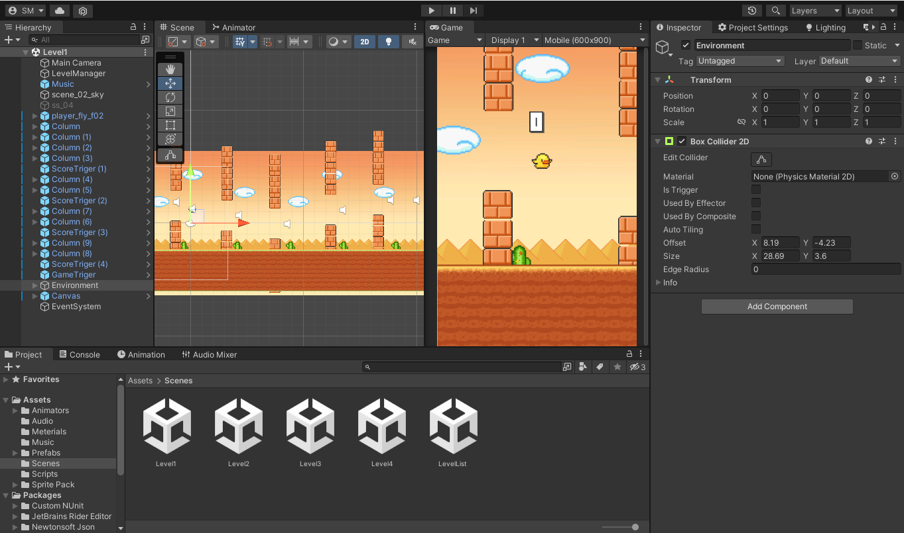
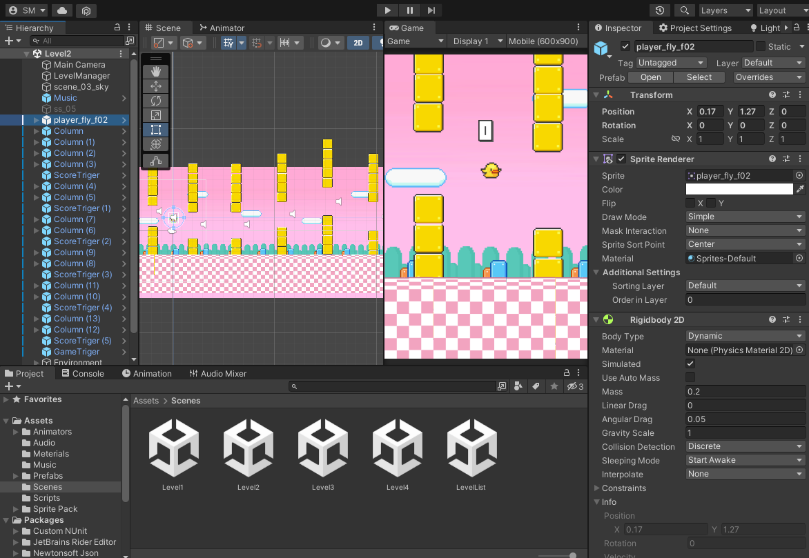
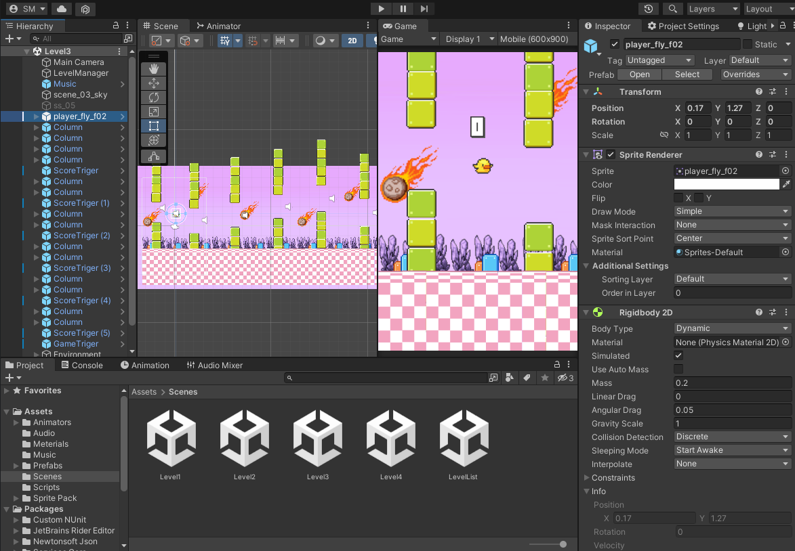
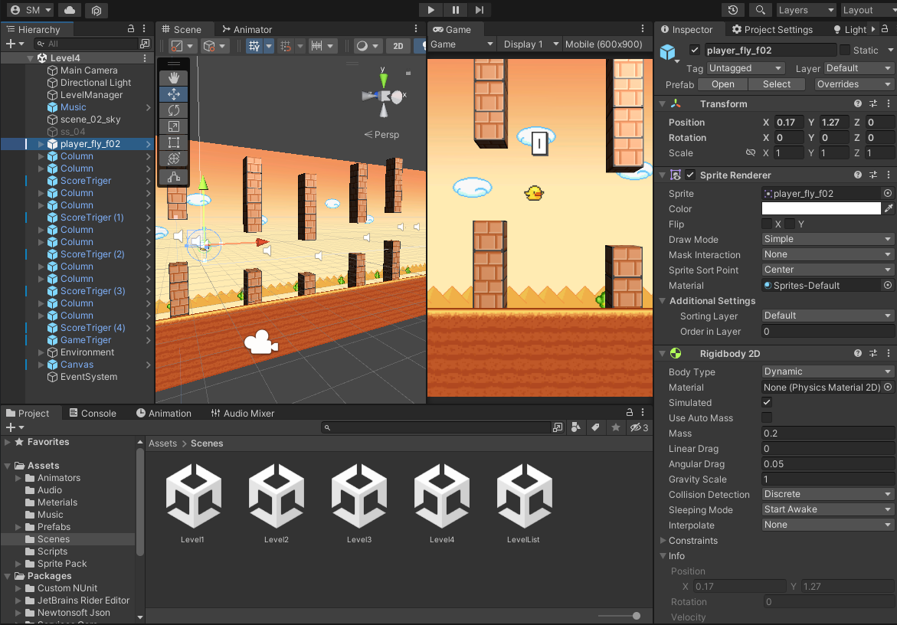

# FlappyBird

## Implemented:
1) Create project, create first level, create main prefabs, create main logic, start second level
2) Create logic Level-List scene, create Trigger-Collider for control score and final level, create logic for show score
3) Create logic for screen-tap (mobile) type game, prepare game for build
4) Create new level with internet assets and image-editor
5) Create new 3D-scene in 2D-project, add light, create material for 3D-colons, change camera on perspective, add distance for layers for parallax style
6) Create animation for Bird, create logic for show hit sprite, correction scrip for control bird
7) Add sounds, add music, add mixer, create logic for play sounds
8) Add game-over animated panel
9) Use sprite-sheet for display score
10) Create save system, create logic for update control active levels in level-list scene

## Unity 2021

